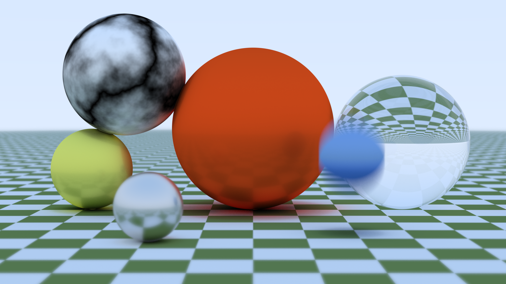
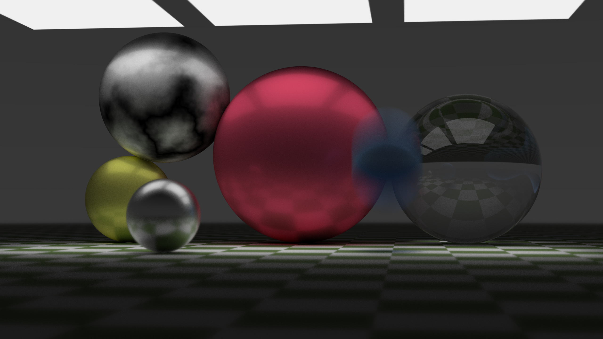

# Wasm-based raytracer written in Rust





A simple raytracer written in the Rust programming language. Requires support for web assembly in the browser.

To run it, you'll need [npm](https://docs.npmjs.com/downloading-and-installing-node-js-and-npm) or [yarn](https://classic.yarnpkg.com/en/).
To build the wasm binaries, you'll need the [rustc compiler](https://www.rust-lang.org/learn/get-started), [rustup tool](https://rustup.rs/) and [wasm-pack](https://github.com/rustwasm/wasm-pack).

First, open terminal in the project folder and then run:
````sh
npm install
````

Then build the wasm binaries:
````sh
npm run wasm
````

Finally, to run the raytracer inside the browser do:
````sh
npm run dev
````

And then navigate to `localhost:3000`

Run the raytracer by adjusting number of rays per pixel and clicking on the render button.

**Warning**: it will probably take over a minute to render an image with more than 50 rays per pixel.
Try using jittered sampling for better performance.
